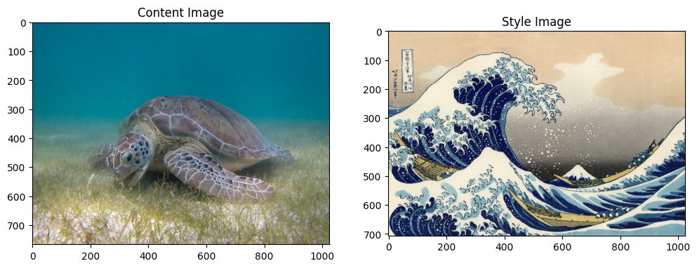
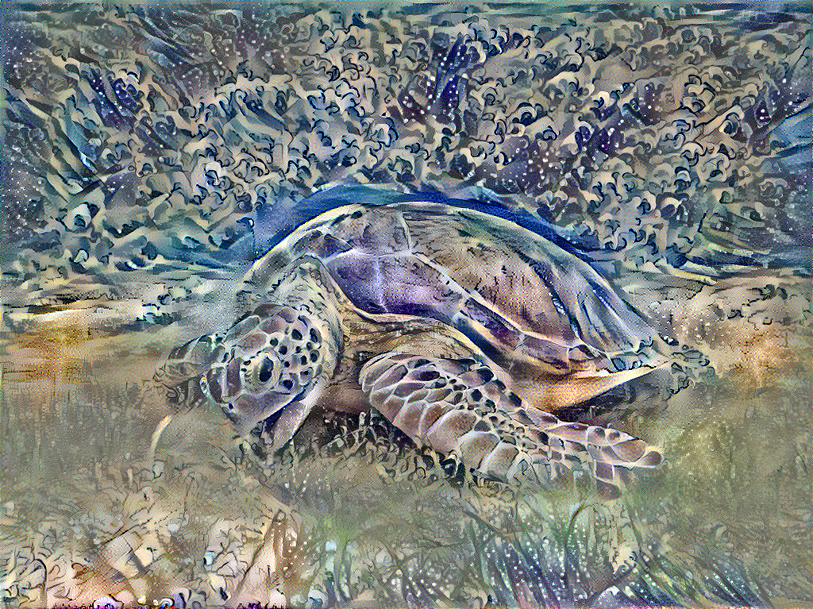

# Neural Style Transfer using Convolutional Neural Networks (CNN)

## 🖼️ Project Overview
This project explores the implementation of **Neural Style Transfer (NST)**, a deep learning technique that merges the content of one image with the artistic style of another, using Convolutional Neural Networks (CNN). NST allows you to blend the content and style representations of two images to create a unique styled image.

This project is a part of my initiative to enhance my **product management skills** through **design decision-making**, **problem-solving**, and **visual modeling**. By working through the complexities of image processing and optimization, I improved my ability to design user-centric, visually appealing solutions.

---

## 🎯 Example Results

### 1. **Photo Example**

#### Content Image And Style Image:

#### Styled Image (Result):

---

### 2. **Video Example**

#### Styled Video Frame (Result):

---

## 🔍 Methodology
The project employs a **pre-trained VGG-19 network** to extract both the content and style representations of images. The content is extracted from the higher layers of the CNN, while the style is captured using **Gram matrices** to model the correlations between feature maps. 

Key Steps:
1. **Content Representation**: Extracted from higher convolutional layers of VGG-19.
2. **Style Representation**: Captured using Gram matrices, representing texture information across multiple layers.
3. **Optimization**: Minimize a total loss function that balances content and style losses to generate the final output.

## 📂 Files in the Repository
- `ML_Neural_Style_Transfer.ipynb`: The Jupyter notebook containing the code implementation of Neural Style Transfer.
- `Research paper - Artistic.pdf`: Reference paper, **"A Neural Algorithm of Artistic Style"** by Leon A. Gatys et al., explaining the neural representations of content and style.

## 🧠 Research Paper Insights
This project builds on the key concepts from **Gatys' paper** (2015), which demonstrated the separation of content and style in images using CNNs trained on object recognition tasks. The NST algorithm extracts high-level image content from deep CNN layers while using Gram matrices to represent texture information from earlier layers.

## 📊 Results
- Successfully blended content and style between images using the VGG-19 network.
- Extended the implementation to video frames, enabling dynamic style transfer.

## 🔧 Tools and Libraries Used
- **TensorFlow** & **Keras**: For building the deep learning model.
- **VGG-19 Pretrained Network**: For extracting content and style features.
- **Python**, **NumPy**, **Matplotlib**: For scripting and visualizing styled images.

## 📈 Skills Gained
- Deep understanding of **Convolutional Neural Networks (CNNs)** and their applications in image processing.
- Experience in **pre-trained model fine-tuning** for specific tasks like Neural Style Transfer.
- Learned to implement **optimization techniques** to minimize combined content and style losses.
- Gained proficiency in Python, TensorFlow, and Keras for deep learning tasks.

## 🏗️ Future Work
- Implement **real-time video style transfer** using similar approaches.
- Optimize the NST process to handle high-resolution images more efficiently.
- Experiment with **layer combinations** for further style enhancement.

## 📚 Datasets
- **Content and Style Image Dataset**: [Art by AI - Neural Style Transfer](https://www.kaggle.com/vbookshelf/art-by-ai-neural-style-transfer)
  - [Images for Style Transfer](https://www.kaggle.com/soumikrakshit/images-for-style-transfer)
